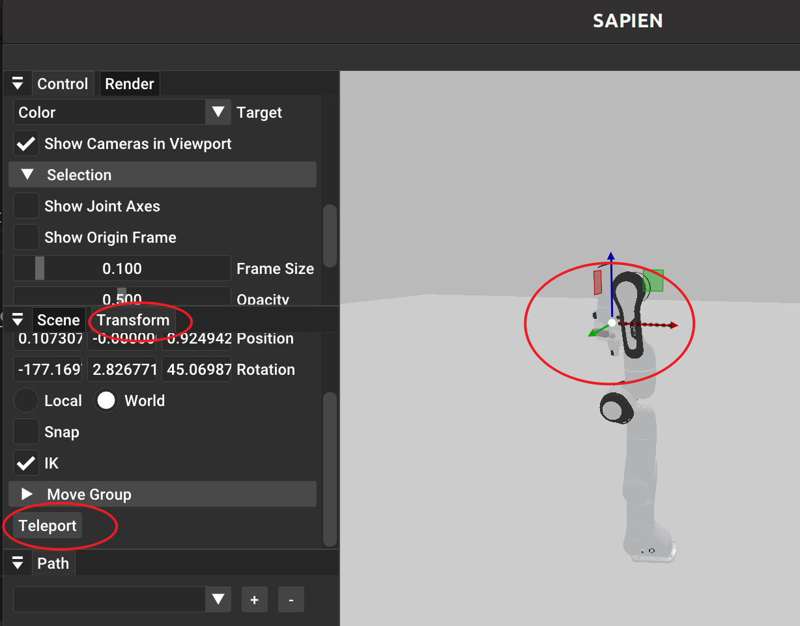
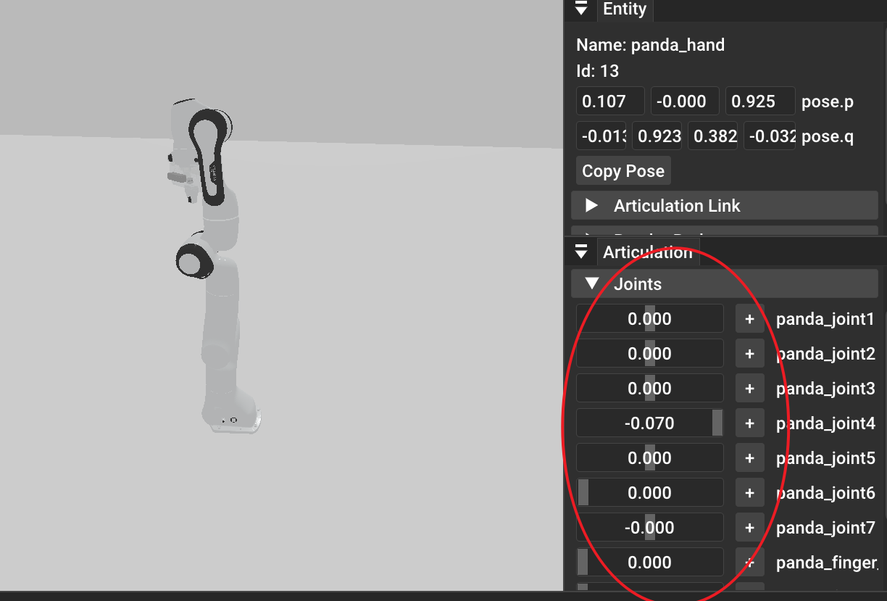

# 介绍
本仓库旨在给机器人初学者提供一个简单易用的仿真环境，以供学习。特点在于省略了ros，rviz等入门门槛较高的部分，直接使用sapien库进行仿真。

# 安装
系统环境要求：

```bash
pip install sapien==3.0.0b1 mplib==0.2.1
```

# 3D模型
模型文件位于 asset目录下，使用者可以自行添加模型文件。这里提供一个urdf库，[PartNet](https://sapien.ucsd.edu/browse)。建议使用者使用学校邮箱进行注册，可以免费下载模型。，可以免费下载模型。

urdf是一种机器人通用描述性文件，可以描述机器人的关节、连杆、传感器、执行器等。可以参考[urdf](https://fishros.com/d2lros2/#/humble/chapt8/get_started/1.URDF%E7%BB%9F%E4%B8%80%E6%9C%BA%E5%99%A8%E4%BA%BA%E5%BB%BA%E6%A8%A1%E8%AF%AD%E8%A8%80), 你可以试试这个生成的urdf是否可以导入到sapien中。

# 机器人
该仓库提供了三款常见的机器人模型，用户可以根据自己需要选择。使用方法如下：

```python
controller = Controller()
robot = controller.add_robot(panda_config)#panda_config需要从config中引用
```

# 运动规划
运动规划采用了[mplib](https://motion-planning-lib.readthedocs.io/latest/tutorials/getting_started.html)库。同样也可以参考[moveit](https://moveit.ai/install-moveit2/binary/)

使用者需要具备一定机器人运动学基础，详细可以参考[机器人运动学](https://fishros.com/d2lros2/#/humble/chapt6/basic/1.%E7%9F%A9%E9%98%B5%E4%B8%8E%E7%9F%A9%E9%98%B5%E8%BF%90%E7%AE%97),建议至少看完第六章内容。

代码中的Pose采用三维位置（xyz，单位为米）和四元数（wxyz，单位为弧度）表示

```python
Pose([0.4, 0.3, 0.12], [0, 1, 0, 0])
```

# 机器人示教
两种示教方式，一种是move_to_pose，一种是move_to_joints。

move_to_pose需要使用者提供目标位置和姿态，move_to_joints需要使用者提供目标关节角度。

**move_to_pose**

点击Transform按钮,然后勾选enable。点击机器人末端执行器，通过移动坐标系（分为Translate和Rotate），然后点击Teleport按钮，即可完成示教。


**move_to_joints**

点击机器人，然后在右下角的joints栏中，移动关节角度，即可完成示教。


可以通过`Copy Joint Position`按钮，复制当前关节角度。 

代码实现：

move_to_pose:
```python
mp.move_to_pose(target_pose)
```

move_to_joints:
```python
mp.move_to_joints(target_joints)
```

# 碰撞检测
这部分内容还未完善，涉及特定任务时，需要使用者自行添加。可以参考[openrave](https://github.com/rdiankov/openrave)

# 最后
该仓库还在不断完善中，欢迎使用者提出宝贵意见。

# Rethink

# Camera Calibration

You need to install pyzbar before you start camera calibration.
```bash
pip install pyzbar
```
[QRcode Generator](https://www.qr-code-generator.com/)
# Envronment

## install libfranka 

We recomand to install panda-python==0.8.0 libfranka==0.9.2

```bash
wget https://github.com/JeanElsner/panda-py/releases/download/v0.8.1/panda_py_0.8.1_libfranka_0.9.2.zip
unzip panda_py_0.8.1_libfranka_0.9.2.zip
pip install panda_python-0.8.1+libfranka.0.9.2-cp310-cp310-manylinux_2_17_x86_64.manylinux2014_x86_64.whl
```
