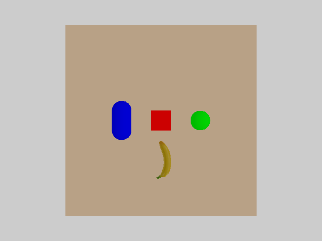
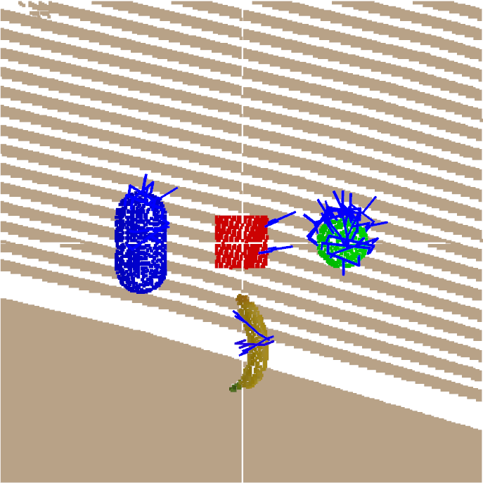

# Introduction

This is a simple trial integrating [*AnyGrasp*](https://graspnet.net/anygrasp.html) with [*Sapien*](https://sapien.ucsd.edu/) simulator. Specifically, we captures a frame of simulated objects and call *AnyGrasp*'s SDK to predict possible grasp pose, which can be used for the robot arm to perform grasping combining with motion planning[(see this branch)](https://github.com/Khlann/MIAA_SIM/tree/miaa_sim).

<p align="center">
  
  
</p>

# Preparation

## AnyGrasp SDK

In general, you can follow the instructions given by *AnyGrasp* [official repository](https://github.com/graspnet/anygrasp_sdk) to build its dependencies.

But regarding of that so many errors have occur since this trial is created, the process of successfully setting up the environment and encountered problems with resolutions are outlined below for reference.

#### Building MinkowskiEngine

The first module needed to build is Nvidia's *MinkowskiEngine*, we followed the [documentation](https://github.com/NVIDIA/MinkowskiEngine#anaconda) of its repository to **build locally**, with:

```
python==3.8.20
cuda==11.1
torch==1.9.0+cu111
torchvision==0.10.0+cu111
gcc==9.5.0
ninja==1.11.1.3
```

Different from the doc, we install *torch* and *torchvision* via *pip*, see [here](https://pytorch.org/get-started/previous-versions/) to install different previous version of *pytorch*, and [here](https://developer.nvidia.com/cuda-toolkit-archive) to install different previous version of *cuda* toolkit.

**Remember to ```pip install ninja``` before building despite it is not mentioned.**

The *cuda* version should be 10.x/11.x according to the doc, but the contributor of *AnyGrasp* released a [branch](https://github.com/chenxi-wang/MinkowskiEngine/tree/cuda-12-1) fixing incompatible problem with *cuda* 12.1, try it if need it.

If your system crashes in building process, try ```export MAX_JOBS=2``` in the terminal.

#### Installing other dependencies for AnyGrasp

```
git clone https://github.com/graspnet/anygrasp_sdk.git
cd anygrasp_sdk
pip install -r requirements.txt
```

If you get complaint about deprecation alias in *numpy*, try ```pip install numpy==1.23.4```(*pip* might warn that module *graspnetAPI* is only compatible with *numpy*==1.20.3, that's fine), we put version information of their requirements.txt below for reference:

```
numpy==1.23.4
Pillow==10.4.0
scipy==1.10.1
tqdm==4.67.1
graspnetAPI==1.2.11
open3d==0.19.0
MinkowskiEngine==0.5.4
```

*AnyGrasp* also needs us to build *pointnet*, just follow their doc.

#### License Registration

Register for the license of using sdk following their [instructions](https://github.com/graspnet/anygrasp_sdk/tree/main/license_registration), if the request is passed, you will receive two pre-trained model weights files and license .zip file, they will be used in our code.

## Installing remaining dependencies

```
git clone https://github.com/Khlann/MIAA_SIM.git
cd MIAA_SIM
git checkout -b anygrasp
pip install -r requirements.txt
```

<!-- Note that we use mplib nightly build to avoid of [issue](https://github.com/haosulab/MPlib/issues/98) due to development accident. If you encounter this issue too and *pip* can not find the nightly package, you can download the .whl file corresponding to your python version from [here](https://github.com/haosulab/MPlib/releases/tag/nightly) then run ```python -m pip install xxx.whl``` to install. -->

## Building AnyGrasp SDK into local repository

1. Download **checkpoint_tracking.tar**, **checkpoint_detection.tar**, **license_{your name}.zip** from received email. Extract the **.zip** file into **MIAA_SIM/license/**, move two **.tar** files into **MIAA_SIM/log/**.

2. Download compiled library files to support API from these site and rename them as [gsnet.so](https://github.com/graspnet/anygrasp_sdk/tree/main/grasp_detection/gsnet_versions), [tracker.so](https://github.com/graspnet/anygrasp_sdk/tree/main/grasp_tracking/tracker_versions), [lib_cxx.so](https://github.com/graspnet/anygrasp_sdk/tree/main/license_registration/lib_cxx_versions), respectively. Put them under **MIAA_SIM/**. Before downloading, choose the version corresponding to your python version, for example, all downloadable versions of **gsnet.so** are listed below:

```
gsnet.cpython-310-x86_64-linux-gnu.so
gsnet.cpython-36m-x86_64-linux-gnu.so
gsnet.cpython-37m-x86_64-linux-gnu.so
gsnet.cpython-38-x86_64-linux-gnu.so
gsnet.cpython-39-x86_64-linux-gnu.so
```

Say you are using python==3.8.x, you should download **gsnet.cpython-38-x86_64-linux-gnu.so**, same for other compiled library files. You can see there are only files corresponding to **3.6 <= python version <= 3.10**, so you should have a compatible python version in advance.

## Running the demo code

```
python main.py --debug
```

If your model weights file is not under the **MIAA_SIM/log/**, you can specify it by passing the argument:

```
python main.py --debug --checkpoint_path={PATH}
```

To try more arguments, see ```python main.py -h```.

If you meet ```The 'sklearn' PyPI package is deprecated, use 'scikit-learn' rather than 'sklearn' for pip commands.```, try ```export SKLEARN_ALLOW_DEPRECATED_SKLEARN_PACKAGE_INSTALL=True```.

## Future works/TODOs

We might utilize the robot arm simulation to complement a whole process of grasping, as well as add more distinct objects in every day life to the simulation scene. Also, *Sapien* provides ray tracking and advance shader features to construct a more realistic simulation scene along with new sensor, which is attracting for more elaboration.
